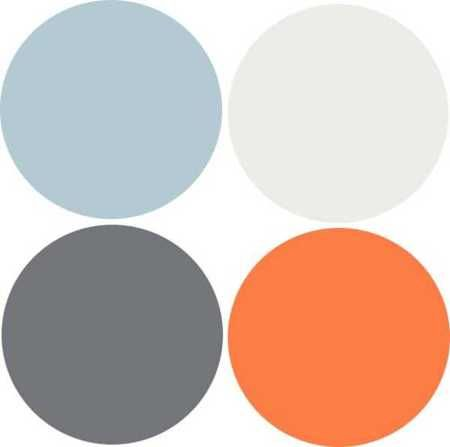

##Style Planning

### The feel of the website

Im going for a modern hipster feel , with warm autumnal colours.

###Color scheme

#FD7E47 - orange
#73777A - dark grey
#ECEDE8 - light grey/whiteish
#B5C9D4 - greyish blue

### Font

- heading -  avenir-next-lt-pro, sans-serif;
- paragraphs and smaller text - 'Open Sans', sans-serif;
  http://type-scale.com/

### logo

