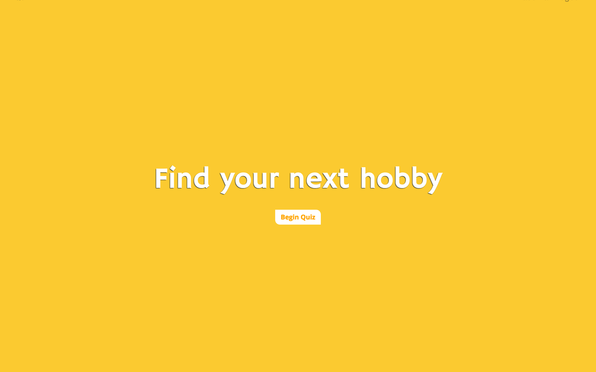
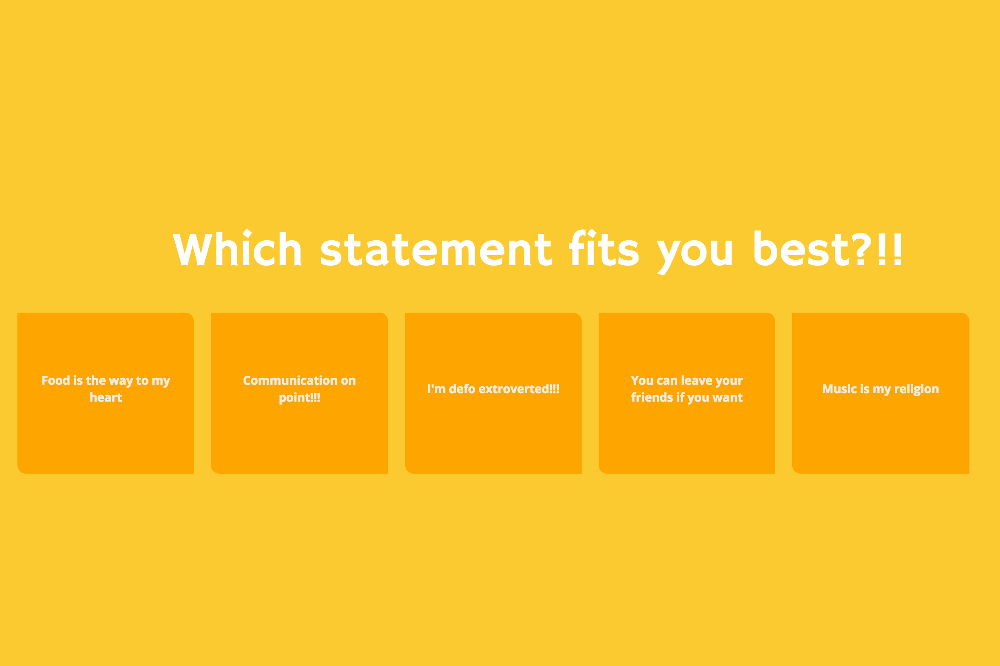
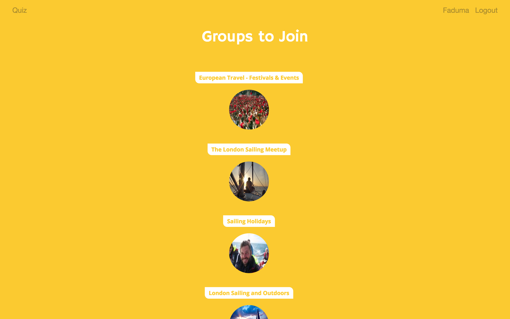
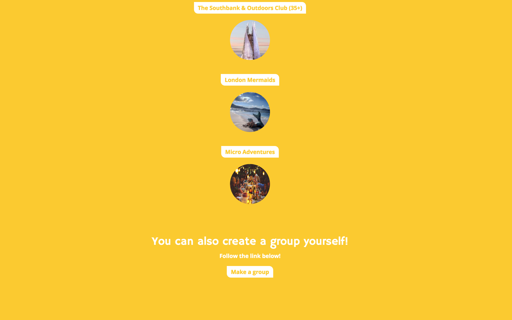
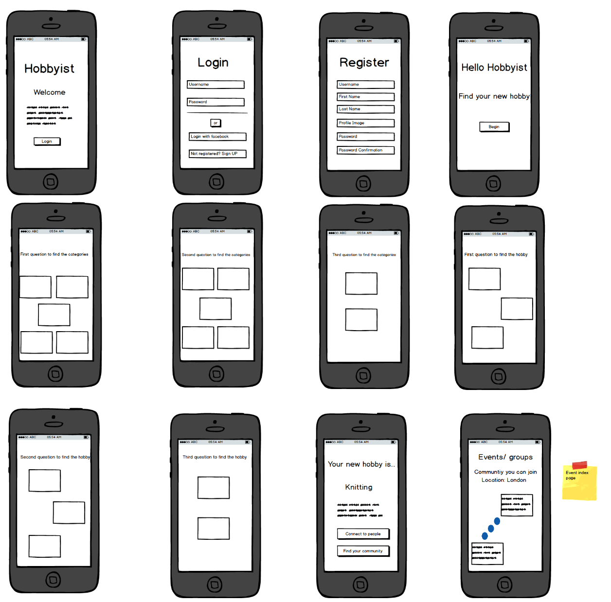

# wdi-project-4

##Intoduction

Hobbyist was made as my final project at General Assembly. This app was created for
serial hobbyist to find new hobbies and meet people with the same interest. I was
inspired by the android.com quiz which finds users a phone suitable for them.
Similarly Hobbyist uses a quiz in order to narrow down the hobbies from 60
hobbies to 1 hobby.

If you want to discover your new hobby follow the link [*here*](https://hobbyist-app.herokuapp.com)

## Goals

- Prioritize your user stories and build a usable product
- Apply skills you’ve learned in previous units
- Build an interactive front-end with a Angular
- Design a visually-impressive front-end.
- Deploy your application online so it's publicly accessible

## Planning

For this project I plan extensively

I used Trello to manage my work flow. Tasks were divided from most important to least.

The wireframe were produced with the user expectation and with mobile responsive in mind.

## Technologies Used

- HTML5
- CSS3
- SASS
- Bootstrap
- Javascript
- jQuery
- Angular
- Nodejs
- Express
- Mongo
- Mongoose
- Animated CSS
- Git
- Github

